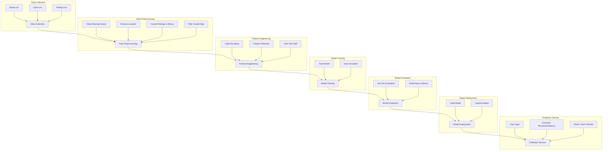

```mermaid
graph TD
    A[Data Collection] --> B[Data Preprocessing]
    B --> C[Feature Engineering]
    C --> D[Model Training]
    D --> E[Model Evaluation]
    E --> F[Model Deployment]
    F --> G[Prediction Service]

    subgraph "Data Collection"
        A1[Books.csv] --> A
        A2[Users.csv] --> A
        A3[Ratings.csv] --> A
    end

    subgraph "Data Preprocessing"
        B1[Clean Missing Values] --> B
        B2[Process Location] --> B
        B3[Convert Ratings to Binary] --> B
        B4[Filter Invalid Data] --> B
    end

    subgraph "Feature Engineering"
        C1[Label Encoding] --> C
        C2[Feature Selection] --> C
        C3[Train-Test Split] --> C
    end

    subgraph "Model Training"
        D1[Train Model] --> D
        D2[Save Encoders] --> D
    end

    subgraph "Model Evaluation"
        E1[Test Set Evaluation] --> E
        E2[Performance Metrics] --> E
    end

    subgraph "Model Deployment"
        F1[Load Model] --> F
        F2[Load Encoders] --> F
    end

    subgraph "Prediction Service"
        G1[User Input] --> G
        G2[Generate Recommendations] --> G
        G3[Return Top-K Results] --> G
    end
```